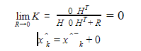
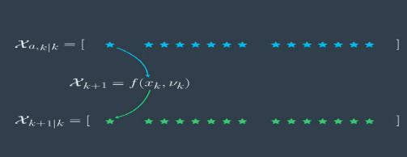
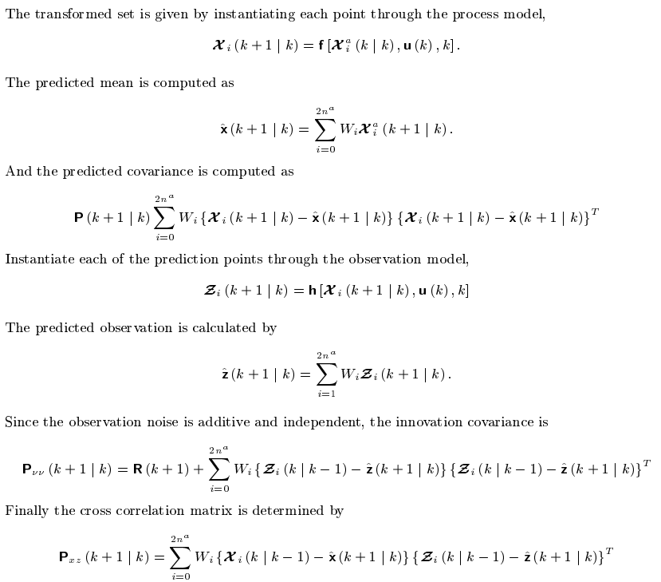

# KF library
## 1.Introduction
###1.1Basics of Kalman Filter
- A Kalman filter is an optimal estimation algorithm used to estimate states of a system from indirect and uncertain measurements.

- A Kalman filter is only defined for linear systems with gaussian distrubution uncertaninty.

- Kalman filter is extensively used in estimating the car position using Lidar and Radar sensors.

- The Kalman filter represents our distributions by Gaussians and iterates on two main cycles: Prediction and Measurement update

###1.2Principles of Kalman Filters

- consider below example of estimating the car position based on the prediction result and measurement result using Kalman filter. We can explain the working principles of kalman filters with the help of probability density function as shown below.

- At initial time step k-1, car position can be in the mean position of gaussian distribution at xk-1 position. At the next time step K, uncertainty at xk position increases which is shown below with larger variance.

- Next one is the measurement result y from the sensors and noise represented in the variance of the third gaussian distribution as shown below.

- Kalman filter says optimal way to estimate the position is combining these two results. This is done by multiplying these two probability functions together and the result will also be another gaussian function.

##2.Stochastic Estimation
- While there are many application-specific approaches to “computing” (estimating) an unknown state from a set of process measurements, many of these methods do not inherently take into consideration the typically noisy nature of the measurements.

- This noise is typically statistical in nature (or can be effectively modeled as such), which leads us to stochastic methods for addressing the problems.

###2.1 State Space Model
- State-space models are essentially a notational convenience for estimation and control Problems.

- Consider a dynamic process for a vehicle , required to control the throttle(input) to achieve a certain velocity(output).

- If it’s required to watch the position of the vehicle , and the position state is an internal state that can’t be measured.In that case state observer is used to estimate the internal state based on the input/output of the dynamic process.

###2.1 Observer Design Problem
- The state observer can be used to detect/estimate the internal state of dynamic model.

- The following figure shows how the observer works.

- The derivation of the state observer goes as follows:

- The observer can estimate the internal state if only the dynamic model is deterministic.

###2.3 Stochastic Process Model
- There is typically a process model that models the transformation of the process state. This can usually be represented as a linear stochastic difference equation similar to equation:

     

- Where wk-1, vk are random variables representing the process and measurement noise respectively.
- It’s considered here the common case of noisy sensor measurements. There are many sources of noise in such measurements. For example, each type of sensor has fundamental limitations related to the associated physical medium, and when pushing the envelope of these limitations the signals are typically degraded. In addition, some amount of random electrical noise is added to the signal via the sensor and the electrical circuits.

- There is the additional problem that the actual state transform model is completely unknown. While we can make predictions over relatively short intervals using models based on recent state transforms, such predictions assume that the transforms are predictable, which is not always the case.

##3.Linear Kalman Filter
- The Kalman filter is essentially a set of mathematical equations that implement a predictor-corrector type estimator that is optimal in the sense that it minimizes the estimated error covariance—when some presumed conditions are met.

- Of particular note here, the Kalman filter has been used extensively for tracking in interactive computer graphics.

###3.1 The Discrete Kalman Filter
- The Kalman filter addresses the general problem of trying to estimate the statexn of a discrete-time controlled process that is governed by the linear stochastic difference Equation:

- The random variables and represent the process and measurement noise (respectively). They are assumed to be independent (of each other), white, and with normal probability distributions
    p(w) N(0,Q)
    p(v) N(0,R)

- In practice, the process noise covariance   and measurement noise covariance matrices might change with each time step or measurement, however here we assume they are constant.

- In equation(6)
    A :The n x n state matrix which relates the state at the previous time step to the state at        the current step since the estimate states x belongs to subset (R^n).
    B: The n x l matrix relates the optional control input u belnogs to subset (R^1) to the state x.
- In equation (7) H: The m x n  matrix in the measurement relates the state x to the measurement zk  belnogs to subset (R^m).

###3.2 The Computational Origins of the Filter
- Defining the following :

 

- In deriving the equations for the Kalman filter, we begin with the goal of finding an equation that computes an a posteriori state estimate as a linear combination of an a priori estimate and a weighted difference between an actual measurement and a measurement prediction as shown below in equation (10).

 

- The difference (zk - Hxk -) in equation (10) is called the measurement innovation, or the residual. The residual reflects the discrepancy between the predicted measurement and the actual measurement . A residual of zero means that the two are in complete Agreement.

- The(n x m) matrix K in equation (10) is chosen to be the gain or blending factor that minimizes the a posteriori error covariance equation(9). This minimization can be accomplished by first substituting equation (10) into the above definition for , substituting that into equation (8), performing the indicated expectations, taking the derivative of the trace of the result with respect to K, setting that result equal to zero, and then solving for K

 

- In equation(11) , if R=0

 

that as the measurement error Hxk - covariance R approaches zero, the actual measurement is “trusted” more and more, while the predicted measurement is trusted less and less.

- In In equation(11) , if Pk-=0

 

As the a priori estimate error covariance approaches zero the actual measurement is trusted less and less, while the predicted measurement is trusted more and more.

###3.3 The discrete Kalman Filter Algorithm
- The Kalman filter estimates a process by using a form of feedback control: the filter estimates the process state at some time and then obtains feedback in the form of (noisy) measurements.

- The equations for the Kalman filter fall into two groups: time update equations and measurement update equations.The time update equations are responsible for projecting forward (in time) the current state and error covariance estimates to obtain the a priori estimates for the next time step.

- The measurement update equations are responsible for the feedback—i.e. for incorporating a new measurement into the a priori estimate to obtain an improved a posteriori estimate.

- The time update equations can also be thought of as predictor equations, while the measurement update equations can be thought of as corrector equations.

- Indeed the final estimation algorithm resembles that of a predictor-corrector algorithm for solving numerical problems as shown below in Figure

 

##3.Extended Kalman Filter
- Extended Kalman Filters(EKF) linearize the distribution around the mean of the current estimate and then use this linearization in the predict and update states of the Kalman Filter algorithm.

- The state x is represented by gaussian distribution which is mapped to Nonlinear function, then resulting function will not be a gaussian function and in that case the (prediction/measurement) non-linear function will not fit in the linear kalman filter and the extended will be used instead.

 

###3.1Extended Kalman Filter basics
- If a non linear function fed to gaussian distribution then the output is not a gaussian.

 

- To solve this issue we need to linearize the function , so when it fed to gaussian distribution then the output is a gaussian.

 

- This can be achived by using First Order Taylor Expansion to linearise the function.

 

- The Jacobian Matrix defined as

 

 and G could represents the state matrix a(in case the prediction model is non-linear) or the output matrix h(in case the measurement model is non-linear)

###3.2Extended Kalman Filter Algorithm
- The algorithm of extended kalman filter as follow

 

- Compared with linear kalman filter algorithm at the state matrix A changed F(the joacbian of state matrix) and the output matrix C changes to H(the jacovian of the output matrix) and the rest of the algorithm are the same.

- There are few drawbacks to EKF like the difficulty in calculating the jacobians , the high computational cost if the jacobians and if the model is differentiable or not.

##4.Unscented Kalman Filter
- UKF using a new technique to Linearize the non-linear function called unscented transformation which uses a set of appropriately chosen weighted points to parameterise the means and covariances of probability distributions.

- The unscented transformation yields performance of the estimator equivalent to the KF for linear systems yet generalises elegantly to nonlinear systems without the linearisation steps required by the EKF.

- it is easier to approximate a Gaussian distribution than it is to approximate an arbitrary nonlinear function or transformation

- A set of points (or sigma points) are chosen so that their sample mean and sample covariance are x and Pxx.

 

###4.1Unscented Kalman Filter basics
- Compute the so called sigma points for the non-linear function for n -dimensional random variable x with mean and covariance Pxx is approximated by 2n + 1 weighted points given by:

 

- In the prediction step predict the sigma points using the non-linear function and calculate the predicted state vector

 

- In the prediction step Predict mean and covariance

 

- In the follwoing figure a summary for the prediction step:
 

- In the update step transform the predicted state into measurement space

 

- In the update step calculate the mean and the covariance for the measurement predicted state

 

- In the update step calculate the updated mean and the covariance
 
 

###4.2Unscented Kalman Filter Algorithm
- The steps to implement the algorithm as follow:

 

- Almost UKF and EKF are the same which proves that UKF algorithm is working properly and the approxomation of gaussian is valid

 

- comparison between mone-carlo , EKF and UKF output , as its shown the UKF output almost similar to mone-carlo output.UKE has a better approximation results that EKF in non-linear models

 

