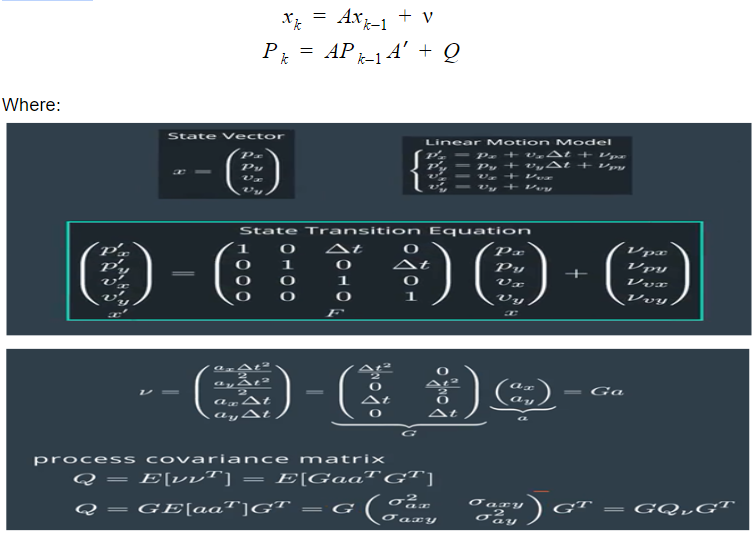

# kfApp(Pedestrian Tracking)

- In this application , It is required to detect a pedestrian moving(using only lidar sensor) from p1(x1,y1) -->p2(x2,y2) as shown in the following figure:

 

- To detect the pedestrian , a mathematical model is required.In this application  the pedestrian moves at constant velocity , actually this is not realistic , also there is no information about the acceleration , so it will be the stochastic part as shown in the following equations:

 

where:

 

- After the derivation of stochastic parts , the motion model will be as following:

 

where:

 

- The final form of the process model(prediction model for standard KF)  will be as following :

 
 

- The measurement model for pedestrian tracking as follow:

 
Where the measurements are px , py the position of pedestrian in x-y coordinates using laser sensor .

- The innovation = The measurement vectore - predicted vector
 
 H will be identity matrix[1*2]

- The sensor used to detect the pedestrian position is LIDAR (Light Detection and Ranging).
- LIDAR uses infrared laser beam to determine the distance between the sensor and the object.
- LIDAR perform better even in case of rains and fog environment.
- LIDAR is the main source for generating point cloud.


