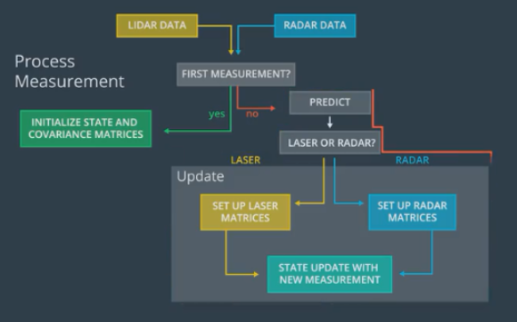
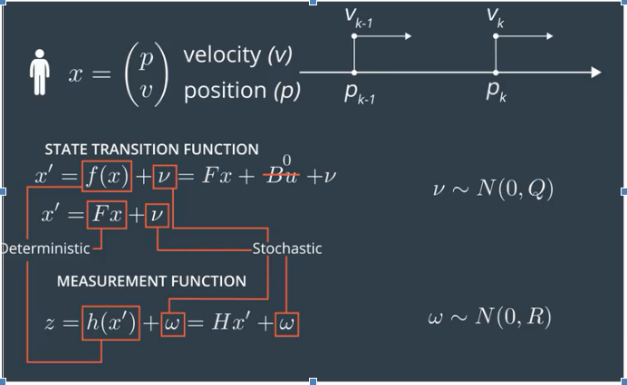

# ukfApp(Pedestrian Tracking)
- In this application , It is required to detect a pedestrian moving(using lidar and radar sensor) from p1(x1,y1) -->p2(x2,y2) as shown in the following figure:

 

- In this application the sensors(lidar and radar) readings will be fused to increase the performance of detecting the pedestrian.

- The roadmap for sensor fusion in this application as follow:

 

- The pedestrian motion model where x represents the state vector, F is the state transition matrix , h the state output matrix and (v,w) represent the stochastic part in kalman filter.

 

- The pedestrian motion model will be used is CTRV (constant turn rate and velocity).

- In the state vector x of pedestrian, px , py --> are the position , vx,vy  --> are the velocity , ψ ,ψ’ -->are for the orientation as follow:

 

- Assuming that the pedestrian walking with circular path , then the state x shall be as follow:

 

- The stochastic part in in pedestrian model as follow:

 

- The final form of the process model(prediction model for unscented KF)  will be as following :

 

- In the measurement step(LIDAR),which a linear measurement model:

 

Where the measurements are px , py the position of pedestrian in x-y coordinates using laser sensor .

- The innovation = The measurement vectore - predicted vector

 

 H will be identity matrix[1*2]

- The sensor used to detect the pedestrian position is LIDAR (Light Detection and Ranging).

- LIDAR uses infrared laser beam to determine the distance between the sensor and the object.

- LIDAR perform better even in case of rains and fog environment.

- LIDAR is the main source for generating point cloud.

- In the measurement step(RADAR),which a non-linear measurement model and the radar reading are not the px, or py.

 

- Due the radar measurement readings space is different that state space , so modification need to be made as follow:

 

- Radar uses doppler effect to measure spedd through meaning the change of radar wave based on motion of the object (moving away/moving close).

- Radar readings are the least affected by rain and fog.

- Radar hs wide field of view about 150 deg , and a range of 200(m).It has low resolution compared with radar.

